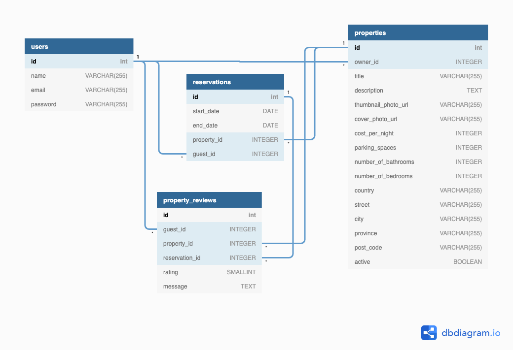

# LightBnB

A simple multi-page Airbnb clone that uses a server-side JavaScript to display the information from queries to web pages via SQL queries.

## Setup

Install  PostgreSQL to `LightBnb/` directory

Apple Silicon
Start: ` brew services start postgresql`
Stop: `brew services stop postgresql`

WSL2 & Vagrant
Start: `sudo service postgresql start` or `startpostgres`
Stop: `sudo service postgresql stop`

Connect to PostgreSQL and create an account

`psql`

Creating a super user

``` sql
CREATE ROLE lightbnb LOGIN SUPERUSER PASSWORD 'lightbnb';
```

Create the database

``` sql
CREATE DATABASE lightbnb;
```

## Run

Connect to your database: `\c lightbnb` at `LightBnB/` directory in your `psql` terminal

Install  `npm install -g npx` to `LightBnB/LightBnB_WebApp/` directory

To start running the app: `npm run local` and view at `localhost:3000`

## Functionalities

### Sign up and Login

Register to become a user.


### Filter

Users can filter through existing property listings, by selecting the desired queries.


### Create

Users can create their own property listing.


## Stretch Features

1. Added rates and guest_reviews tables in `migrations/01_schema.sql`
2. Refactored the pool queries `/LightBnB_WebApp/db/database.js` into `LightBnB_WebApp/db/queries` directory

## Documentation

My rough sketch of the entity relationship diagram for ideation before implementing.


Actual entity relationship diagram based on the current repo.




### LightBnB Back-End
-  The schema for all of the tables can be found in `/migrations/01_schema.sql`
-  Fake data for the tables can be found in `/seeds`

### LightBnB Front-End

Front-end boilerplate code was referenced from this repo :
https://github.com/lighthouse-labs/LightBnB_WebApp

- `db` contains all the database interaction code.
    - `json` is a directory that contains a bunch of dummy data in `.json` files.
    - `database.js` is responsible for all queries to the database. It doesn't currently connect to any database, all it does is return data from `.json` files. This is where we will be writing the database queries.
- `public` contains all of the HTML, CSS, and client side JavaScript. We're not really interested in that right now.
- `routes` contains the router files which are responsible for any HTTP requests to `/users/something` or `/api/something`.
- `styles` contains all of the sass files. Again, not really interesting right now.
- `server.js` is the entry point to the application. This connects the routes to the database.

## Future Enhancements
### Guest Reviews and Ratings
The database includes `guest_reviews` and `ratings` tables to support potential future development of a review and rating system for the property listings. While these features are not currently integrated into the front-end, the backend structure is ready to support them with the following endpoints (suggested for future implementation):

- `/reviews`: Fetch guest reviews for properties.
- `/ratings`: Fetch ratings for properties.

These features can enhance the user experience by allowing users to read reviews and see ratings for properties, making it easier for them to make informed decisions.
